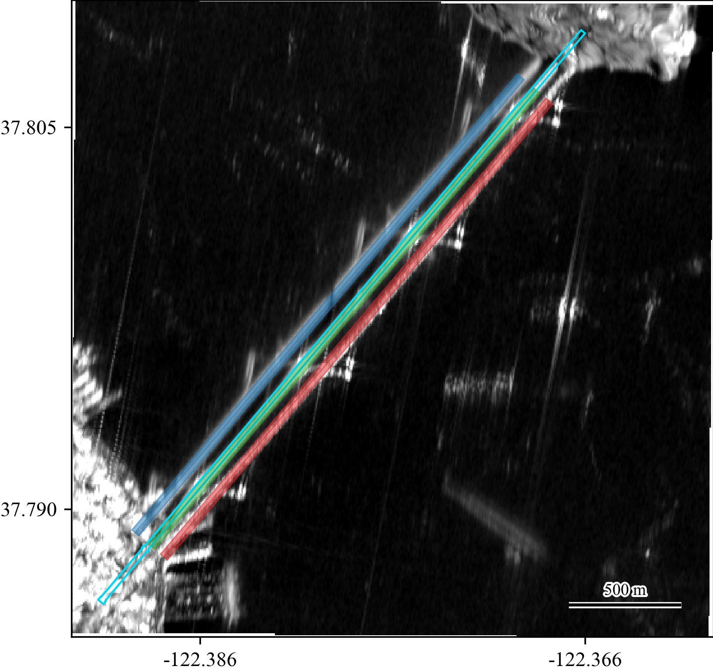
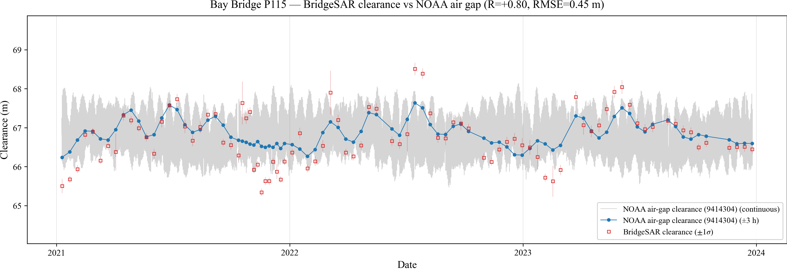

# BridgeSAR

[](https://pypi.org/project/bridgesar/)
[](https://www.python.org/downloads/)
[](https://opensource.org/licenses/MIT)
[](https://doi.org/10.5281/zenodo.23029548)

**Geometry-guided estimation of bridge–water clearance from SAR multipath scattering stripes.**

BridgeSAR measures the vertical clearance between a bridge deck and the water
below it directly from spaceborne radar amplitude images — no in-situ sensor
required at the bridge itself.

## The key idea

When a satellite radar looks sideways at an elevated bridge spanning water, the
signal can reach the sensor along several paths. In addition to the direct
return from the bridge superstructure, energy bounces between the bridge and the
water surface before returning. These multipath returns land at different radar
ranges and appear in the amplitude image as a set of bright, range-displaced
**stripes** running parallel to the bridge:

- **S** (single bounce) — direct scattering from the bridge deck/superstructure.
- **D** (double bounce) — a water/bridge two-path return.
- **T** (triple bounce) — a water-mediated path involving the water surface and
  the lower bridge elements; it is the most sensitive to the bridge–water
  clearance.

The **perpendicular spacing between the stripes** encodes the clearance. Given
the radar incidence angle and the angle between the bridge axis and the
horizontal projection of the radar line-of-sight (LOS), stripe spacing converts
directly to height. Because the **single-to-triple (S→T) separation** averages
out noise on the intermediate D peak, it is the most stable observable.

To find and orient the stripes without any training data, BridgeSAR uses the
bridge geometry from **OpenStreetMap** as a zero-training prior. For each
acquisition it:

1. rotates the amplitude image so the bridge axis is vertical (a small rotation
   refinement around the OSM bearing),
2. accumulates amplitude energy along the bridge length to build a
   high-SNR profile perpendicular to the axis,
3. sub-pixel-locates the S, D and T peaks with a joint three-peak fit, and
4. converts the S–D, D–T and S–T spacings to clearance using the incidence
   angle and bridge/LOS azimuth.

The single bounce is fit on a global mean image (it barely moves with water
level); the D and T peaks are fit on a short local-mean stack to suppress speckle
while preserving the water-level-dependent displacement. The resulting clearance
time-series can be compared against a NOAA on-bridge **air-gap** sensor or a
nearby **water-level** gauge.

## Inputs and outputs

- **Input:** VV-polarized OPERA CSLC-S1 amplitude images (Sentinel-1),
  streamed straight from NASA Earthdata / ASF into an amplitude-only Zarr store,
  plus an OpenStreetMap bridge centerline.
- **Output:** a per-date clearance time-series (`H_SD`, `H_DT`, `H_ST`,
  `H_mean`, each with an SNR-based uncertainty).

## Installation

```bash
pip install bridgesar
```

or from source:

```bash
git clone https://github.com/smuinsar/BridgeSAR
cd BridgeSAR
pip install -e ".[dev,notebook]"
```

### Earthdata credentials

Streaming OPERA CSLC-S1 requires NASA Earthdata / ASF access. Create a free
account at <https://urs.earthdata.nasa.gov> and put your credentials in
`~/.netrc`:

```
machine urs.earthdata.nasa.gov login YOUR_USERNAME password YOUR_PASSWORD
```

`earthaccess.login()` reads this file automatically.

## Quickstart

BridgeSAR is config-driven: one YAML file per bridge/track holds the streaming
ROI, deck geometry, averaging window, NOAA reference stations and the OSM query.

### Using a bundled configuration

Nine ready-to-run configs ship inside the package — the three California
multi-track bridges plus three single-track bridges. Load one by name with
`BridgeConfig.named(...)`; no file path is needed because the YAML travels with
the install:

```python
from bridgesar import BridgeConfig

BridgeConfig.list_bundled()
# ['baybridge_p035', 'baybridge_p042', 'baybridge_p115',
#  'goldengate_p035', 'goldengate_p042', 'goldengate_p115',
#  'reedypoint_p106', 'haleboggs_p165', 'hueylong_p165']

cfg = BridgeConfig.named("baybridge_p115")   # one of the names above
cfg.project_dir = "/path/to/data"            # where streamed data + outputs go
cfg.resolve_paths()
```

`resolve_paths()` derives the per-bridge data layout under `project_dir`:

```
{project_dir}/{Bridge}/{TRACK}/OPERA_CSLC_S1_T{n}.zarr   # streamed amplitudes (read directly)
{project_dir}/{Bridge}/{TRACK}/Amplitudes/*_amp.tif      # optional exported GeoTIFFs (GIS only)
{project_dir}/{Bridge}/Inventory/osm_{bridge}.geojson    # OSM centerline
{project_dir}/{Bridge}/output/                           # CSV + figures
```

(The `name` passed to `named()` is the YAML's file stem; the `--config` CLI flag
takes a path to any YAML, bundled or your own.)

### Running the pipeline

```python
from bridgesar import ClearancePipeline
from bridgesar.osm import fetch_from_config
from bridgesar.stream import stream_amplitudes

# cfg is the resolved BridgeConfig from above.
fetch_from_config(cfg)                                # OSM centerline
stream_amplitudes(cfg, "2021-01-01", "2024-12-31")    # -> amplitude-only zarr

pipe = ClearancePipeline(cfg).setup()       # reads amplitudes from the zarr
df = pipe.run_timeseries()                  # per-date clearance estimates
kept = pipe.filter_timeseries(df)           # contrast / outlier filtering
ref = pipe.airgap_reference(kept)           # compare vs NOAA air gap
print(f"R={ref['R']:+.3f}  RMSE={ref['RMSE_m']:.2f} m")
```

The pipeline reads amplitudes **directly from the zarr store** — there is no
separate GeoTIFF export step. If you want per-date GeoTIFFs for GIS inspection,
they are optional:

```python
from bridgesar.amplitude import export_amplitudes_from_zarr
export_amplitudes_from_zarr(cfg.zarr_path, cfg.amp_dir)   # optional
```

Or from the command line:

```bash
DATA=/path/to/data
bridgesar-osm        --config configs/baybridge_p115.yaml --project-dir $DATA
bridgesar-stream     --config configs/baybridge_p115.yaml --project-dir $DATA \
                     --date-start 2021-01-01 --date-end 2024-12-31
bridgesar-timeseries --config configs/baybridge_p115.yaml --project-dir $DATA --reference airgap
```

(`configs/baybridge_p115.yaml` here is any config YAML; the bundled ones are also
loadable in Python via `BridgeConfig.named("baybridge_p115")`.)

## Example notebook

A complete, runnable walkthrough lives in
[`examples/baybridge_p115_clearance.ipynb`](examples/baybridge_p115_clearance.ipynb).
It estimates the San Francisco–Oakland Bay Bridge West Span clearance on track **P115 over
2021–2023**, live-streaming the amplitudes from Earthdata, and compares the
BridgeSAR time-series against the on-bridge NOAA air-gap sensor (station 9414304).
The notebook covers every step end to end: load the bundled config, check
`~/.netrc`, fetch the OSM centerline, stream amplitudes (with a progress bar),
run the clearance time-series, filter, fetch the reference, and
plot. 



The multipath stripes BridgeSAR extracts, over the global mean amplitude image of
the Bay Bridge West Span (descending track P115): the **single-bounce (S)** stripe in red, the
**double-bounce (D)** stripe in green and the **triple-bounce (T)** stripe in blue.
The cyan polyline is the OpenStreetMap bridge centerline used as the zero-training
prior. The perpendicular spacing between these stripes is what BridgeSAR converts
to bridge–water clearance.



BridgeSAR clearance (red squares, ±1σ) tracks the NOAA air-gap clearance
(blue, acquisition-matched; gray, continuous) with R ≈ 0.80 and RMSE ≈ 0.45 m
over the three-year record.

**Note:** the first run streams a few years of amplitudes from Earthdata and can
take a while; the Zarr store and GeoTIFFs are cached, so re-runs skip work
already on disk.

## Bundled bridges

| Bridge | Track(s) | Nominal clearance | NOAA reference |
|--------|----------|-------------------|----------------|
| Reedy Point Bridge (DE)      | P106             | 41 m   | air gap 8551911 + water level |
| Hale Boggs Memorial (LA)     | P165             | 41 m   | water level 8761955 |
| Huey P. Long Bridge (LA)     | P165             | 47 m   | air gap 8762002 + water level |
| Bay Bridge (CA)              | P035, P042, P115 | 62 m   | air gap 9414304 + water level |
| Golden Gate Bridge (CA)      | P035, P042, P115 | 67 m   | water level 9414290 |

## Applying BridgeSAR to a new bridge

BridgeSAR is meant to extend to **any bridge in the United States over water observed by Sentinel-1**,
not just the bundled five. To add one, you write a single YAML config — the same
schema the bundled configs use — and run the identical pipeline. Nothing in the
code is bridge-specific; everything that varies lives in the YAML.

### 1. Write the config

Copy a bundled config as a starting point (a CA bridge for air-gap sites, Golden
Gate for water-level-only sites) and edit the fields. The file below is fully
annotated; only the fields above `# --- optional ---` are required.

```yaml
bridge_name: My Bridge          # free-text; used in plot titles and path names
track: P064                     # Sentinel-1 relative orbit, 'P' + 3 digits.
                                #   Sets the zarr name and the streamed track.

# --- streaming ROI (WGS84 degrees) ---
# A tight box around the bridge deck. Drives which OPERA CSLC-S1 bursts are
# streamed and the mosaic extent. Keep it small (the bridge + a little water).
lat_min: 39.556
lat_max: 39.560
lon_min: -75.584
lon_max: -75.581

# --- deck geometry (meters) ---
deck_height_m: 41.0             # nominal deck-above-water clearance (m). Only a
                                #   reference line for water-level-only bridges.
bridge_thickness_m: 1.5         # superstructure thickness; sets the per-model
                                #   stripe thickness corrections.
scatter_model: mixed            # which stripes the deck produces. One of:
                                #   'mixed' | 'symmetric' | 'lower_triple' | 'lower_single'

# --- local temporal-averaging window for the per-date D+T fit ---
# The double/triple stripes are faint; the fit averages ±k neighboring
# acquisitions. k=0 keeps single-date resolution; k=3 is the most smoothing.
k_before: 0
k_after: 0

# --- optional --- (these have sensible defaults; shown with the defaults)

# outlier filtering applied by filter_timeseries()
contrast_min_threshold: 1.30    # min stripe contrast to keep a date
h_mean_mad_k: 3.0               # robust MAD outlier cut on H_mean (null disables)
mask_towers: false              # NaN-out bright tower rows before fitting

# NOAA reference matching (https://tidesandcurrents.noaa.gov)
wl_avg_halfwin_hours: 3.0       # ± window to match a gauge to each acquisition
wl_primary_id: '8551910'        # primary water-level gauge id
airgap_station: '8551911'       # on-bridge air-gap sensor id, or null if none
wl_stations:                    # one or more nearby water-level gauges
  - {id: '8551910', name: 'Reedy Point, DE', datum: NAVD}   # datum: NAVD | MLLW

# OpenStreetMap bridge geometry (the zero-training prior)
osm:
  names: ['Reedy Point']        # OSM name(s) to search via the Overpass API
  refs: ['DE 9']                # OSM route ref(s), e.g. 'I 80', 'US 101'
  bbox: [39.550, -75.595, 39.565, -75.570]   # search box [S, W, N, E]
  utm_epsg: 32618               # UTM EPSG for the bridge's zone (projects the line)
  name_regex: 'Reedy Point'     # regex selecting the centerline among OSM matches
```

### 2. How the config drives the pipeline

Each block is consumed at a specific stage:

| YAML block | Used by | Effect |
|------------|---------|--------|
| `track`, ROI | `stream_amplitudes` | picks the bursts/dates streamed into the Zarr store |
| `osm.*` | `fetch_from_config` → `ClearancePipeline.setup` | fetches the OSM centerline and projects it to rotate the image and accumulate energy |
| `deck_height_m`, `bridge_thickness_m`, `scatter_model` | per-date fit + conversion | stripe-spacing → clearance and thickness corrections |
| `k_before`/`k_after` | `run_timeseries` | local-mean window for the D/T stripe fit |
| `contrast_min_threshold`, `h_mean_mad_k` | `filter_timeseries` | stripe-contrast and robust outlier rejection |
| `airgap_station`, `wl_*` | `airgap_reference` / water-level comparison | matches a NOAA reference to each acquisition |

Advanced tuning constants (rotation bounds, peak-pick method, SNR floor, etc.)
live in `HyperParams` with shared defaults; override any of them per bridge with
an optional `hyperparams:` mapping in the YAML.

### 3. Run it

Point a `BridgeConfig` at the file and run the same three steps as the bundled
bridges — in Python:

```python
from bridgesar import BridgeConfig, ClearancePipeline
from bridgesar.osm import fetch_from_config
from bridgesar.stream import stream_amplitudes

cfg = BridgeConfig.from_yaml("my_bridge.yaml")   # your file (vs .named() for bundled)
cfg.project_dir = "/path/to/data"
cfg.resolve_paths()

fetch_from_config(cfg)
stream_amplitudes(cfg, "2021-01-01", "2024-12-31")     # -> amplitude-only zarr
df = ClearancePipeline(cfg).setup().run_timeseries()   # reads the zarr directly
```

or from the command line with `--config my_bridge.yaml`. Adapting the example
notebook to a new bridge is a one-line change: swap `BridgeConfig.named(...)` for
`BridgeConfig.from_yaml("my_bridge.yaml")`.

## Pipeline overview

```
stream_amplitudes ──▶ amplitude-only Zarr ──┐   (optional: export GeoTIFFs for GIS)
                                            │
            OSM centerline ──┐              ▼
                             └────▶ ClearancePipeline.setup()
                                     (LOS geometry + global S fit, reads the zarr)
                                                     │
                                  run_timeseries() ──▶ per-date S/D/T fit
                                                     │   + clearance conversion
                                  filter_timeseries()│
                                                     ▼
                                   airgap_reference() / water-level comparison
```

## Citation

If you use BridgeSAR in your research, please cite:

**Kim, J.**, and Lu, Z. (2026), BridgeSAR: Measuring bridge-water clearance from space using SAR multipath signatures, *Geophysical Research Letters*, *53*(19), e2026GL124805, [https://doi.org/10.1029/2026GL124805](https://doi.org/10.1029/2026GL124805)

## License

MIT — see [LICENSE](LICENSE).
